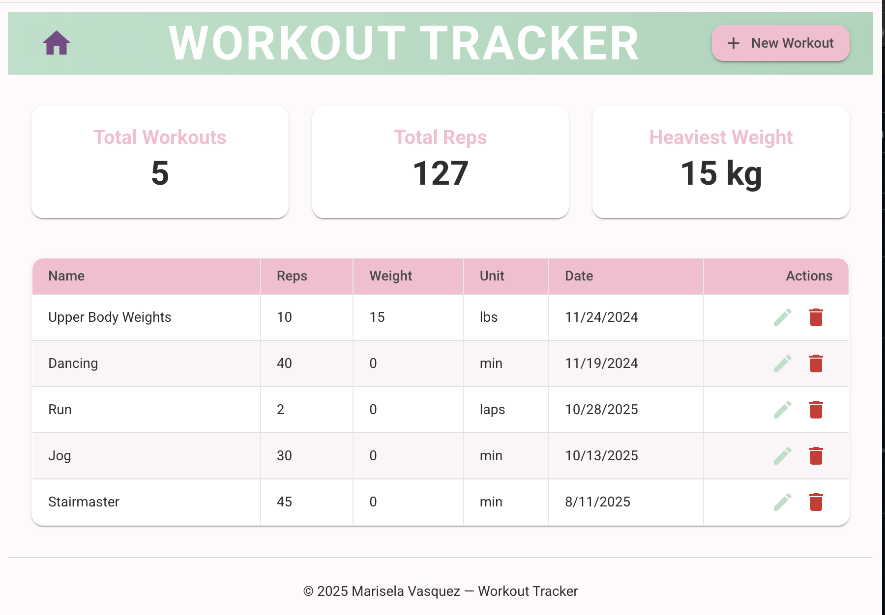

# 🏋️ Exercise Tracker (Full Stack MERN App)

This is a **Full Stack MERN** project that allows users to track their exercises.  
Users can **add**, **edit**, **delete**, and **view** exercises in one place.  
The app uses **MongoDB**, **Express**, **React**, and **Node.js**.

---

## ⚙️ How It Works

- **Frontend (React):** Handles the user interface and navigation.  
- **Backend (Express + Node):** Manages the REST API and connects to MongoDB.  
- **Database (MongoDB):** Stores all exercise data.

---

## 💡 Features

** Add, edit, and delete exercises

** Connected frontend and backend

** Stores data in MongoDB

** Built as a Single Page Application with React Router
